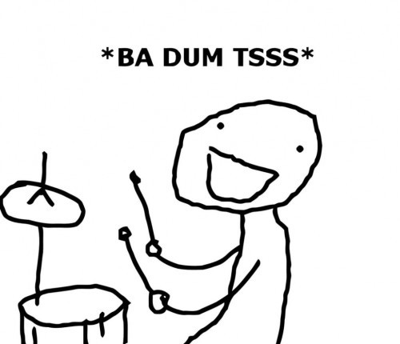

# 0x1A. C - Hash tables

# Resources

<strong>Read or watch</strong>:

<ul>
<li><a href="https://www.youtube.com/watch?v=MfhjkfocRR0" title="What is a HashTable Data Structure - Introduction to Hash Tables , Part 0" target="_blank">What is a HashTable Data Structure - Introduction to Hash Tables , Part 0</a> </li>
<li><a href="https://en.wikipedia.org/wiki/Hash_function" title="Hash function" target="_blank">Hash function</a> </li>
<li><a href="https://en.wikipedia.org/wiki/Hash_table" title="Hash table" target="_blank">Hash table</a> </li>
</ul>

<strong>Learning Objectives</strong>

<ul>
<li>What is a hash function</li>
<li>What makes a good hash function</li>
<li>What is a hash table, how do they work and how to use them</li>
<li>What is a collision and what are the main ways of dealing with collisions in the context of a hash table</li>
<li>What are the advantages and drawbacks of using hash tables</li>
<li>What are the most common use cases of hash tables</li>
</ul>
---
---
<pre><strong>🕊🕊🕊Joke of The day🕊🕊🕊</strong>

HE: You are the ";" to my code 😍 
SHE: Sorry I have Python! 😕 

    
click here

    
 

</pre>

